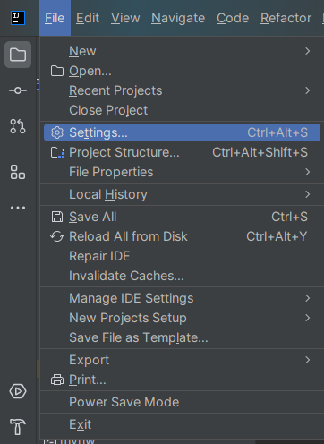
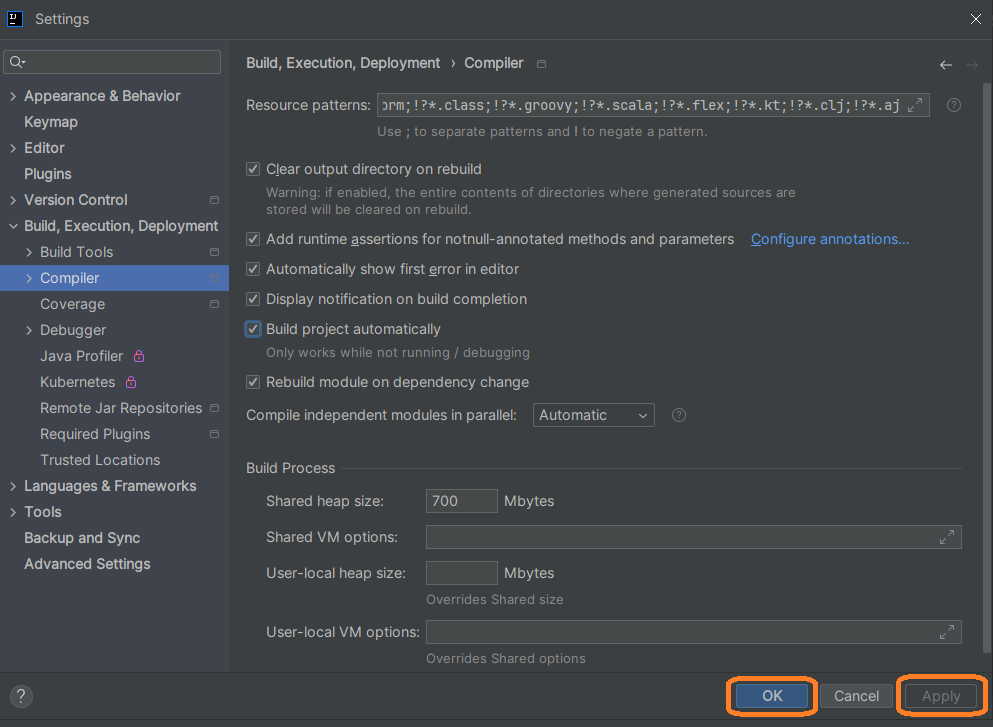
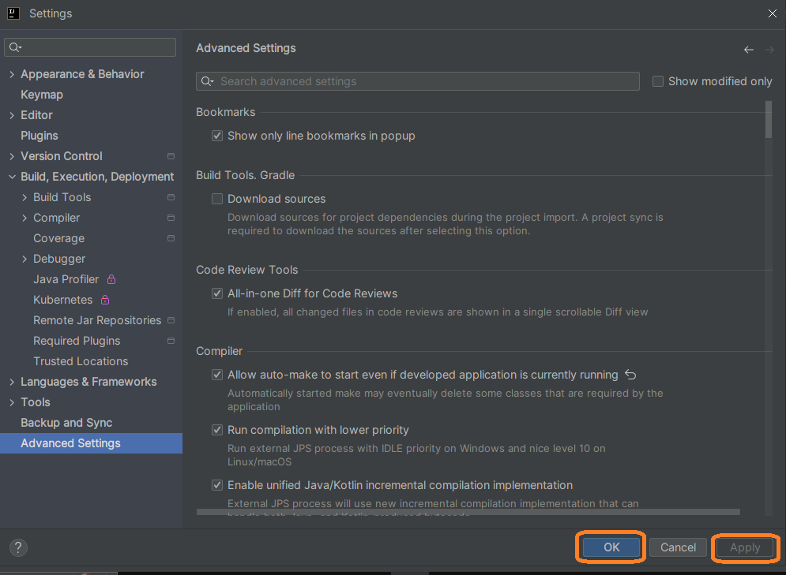

# Proyecto: Alura Foro Hub

## Objetivo

Este proyecto tiene como objetivo aplicar los conocimientos adquiridos en la Beca Oracle One.  
Para este proyecto se tuvo la oportunidad de emplear los conceptos adquiridos en la Programación Orientada a Objetos de Java y el Framework de Aplicaciones Java de Código Abierto Spring.

## Descripción

El proyecto está conformado por

A lo largo de todo el código del proyecto, se abarcaron los siguientes conceptos de Java:

## Capturas de Pantalla

## Requisitos previos a la programación

### Creación del Proyecto Base Springboot
Se procede a crear el proyecto Springboot desde el portal Spring initializr como se muestra en la siguiente imagen. Considerar las dependencias Devtools, Lombok y Spring Web.

- Devtools. Facilita la recarga automática del servidor.
- Lombok. Simplifica la escrirua de código usando anotaciones.
- Spring Web. Básico para desarrollar webs y servicios RESTful.

