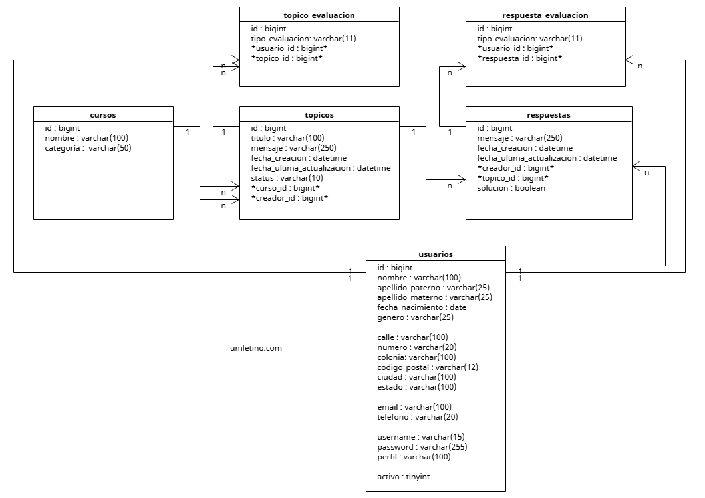
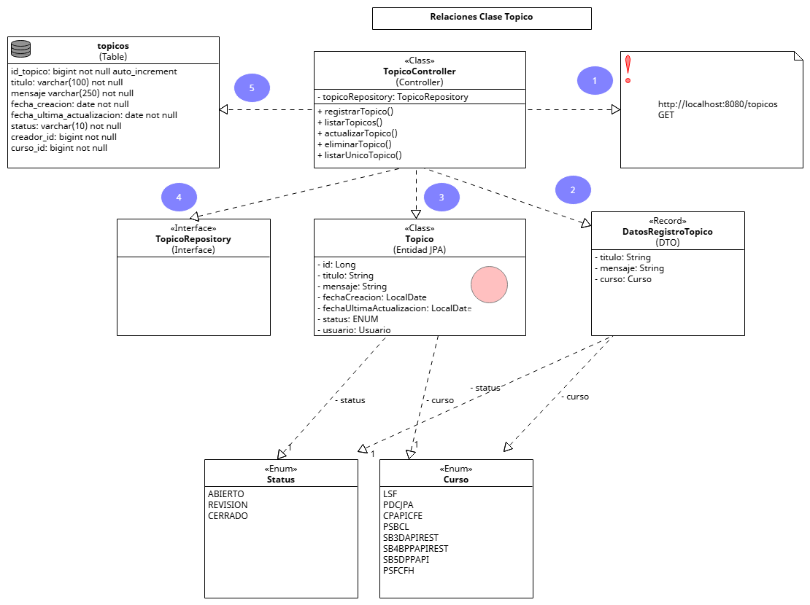
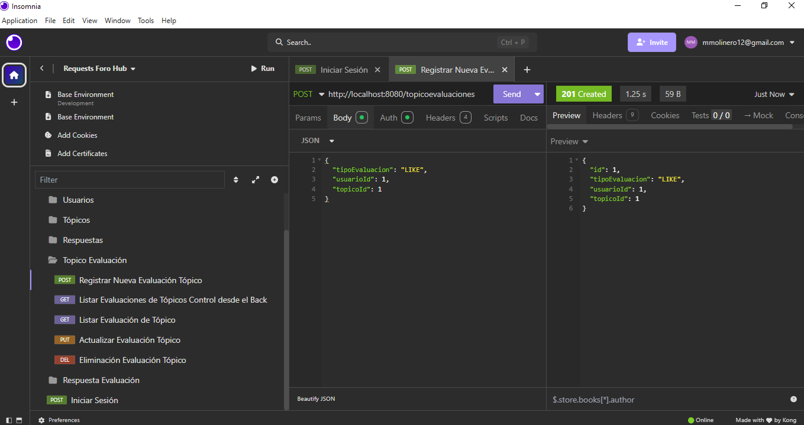
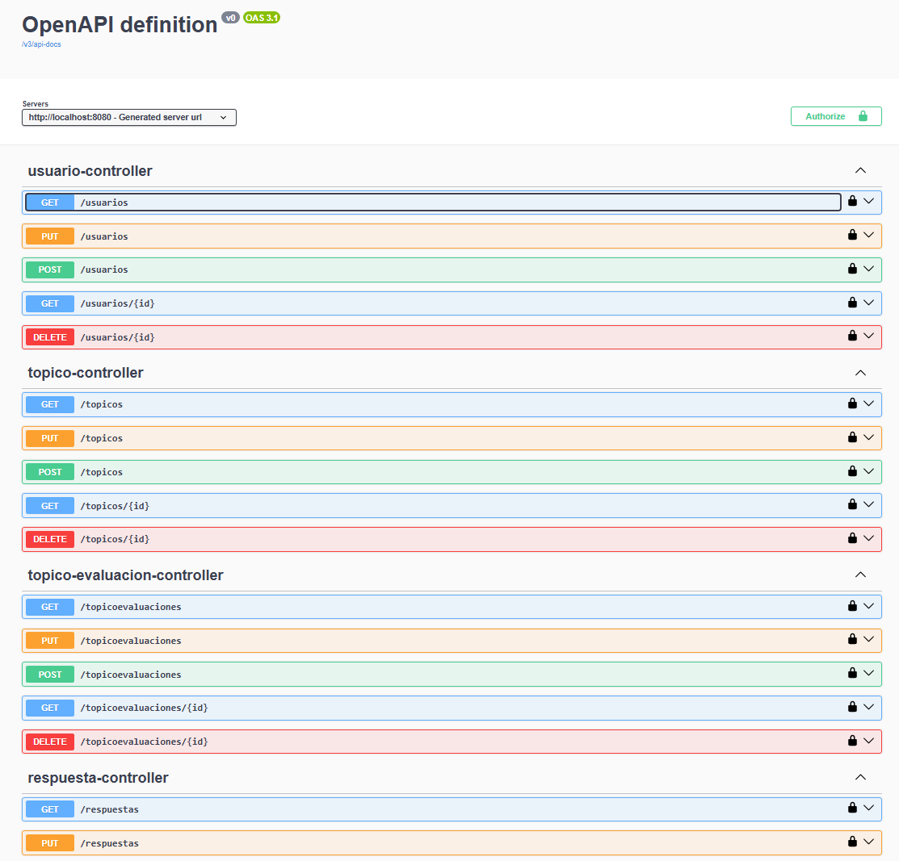
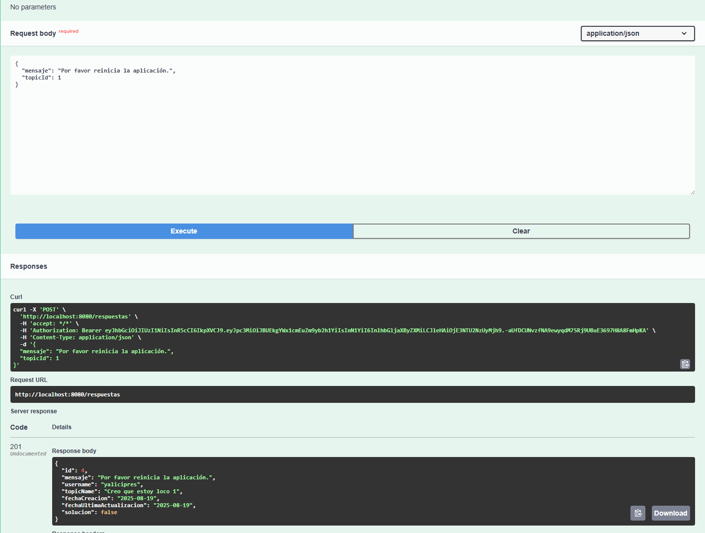

# Proyecto: Alura Foro Hub: Un Sistema de Gestión de Tópicos

## Objetivo

Este proyecto tiene como objetivo aplicar los conocimientos adquiridos en la Beca Oracle One.  
Para este proyecto se tuvo la oportunidad de emplear los conceptos adquiridos en la Programación Orientada a Objetos de Java y el Framework de Aplicaciones Java de Código Abierto Spring Boot.

## Descripción

Esta aplicación es una API REST robusta diseñada para la gestión de tópicos. Permite a los usuarios crear, leer, actualizar y eliminar tópicos y sus respuestas. Construida con Spring Boot y JPA, la API interactúa de forma segura con una base de datos MySQL, utilizando Flyway para la gestión de migraciones, garantizando que el esquema de la base de datos esté siempre sincronizado con el código.

La seguridad es una prioridad clave. El sistema implementa un robusto modelo de autenticación y autorización basado en Tokens JWT, que protege las rutas de la API. Las contraseñas se almacenan de forma segura utilizando BCrypt y la autorización a nivel de método asegura que solo el creador de un tópico pueda realizar operaciones de eliminación. Esto proporciona un entorno seguro y confiable para que los usuarios interactúen.

## Requisitos para la programación


- Devtools: Herramientas de desarrollo de Spring Boot para reinicios automáticos y recargas en vivo.

- Spring Security: Framework para proteger la aplicación, manejando la autenticación y autorización de usuarios.

- SpringDoc: Genera documentación de API (OpenAPI 3) automáticamente a partir del código, como Swagger UI.

- Spring Web: Submódulo de Spring para construir aplicaciones web y APIs RESTful.

- Flyway: Herramienta para gestionar y versionar las migraciones del esquema de la base de datos.

- Lombok: Biblioteca que genera código repetitivo (getters, setters) para mantener el código limpio.

- JWT: JSON Web Token. Un estándar abierto para transmitir información de forma segura entre partes.

- JPA: Java Persistence API. Define un estándar para el mapeo de objetos a bases de datos relacionales.


## Diseño de la Base de Datos MySQL


## Relaciones entre las entidades con la Clase Principal Topico



## Nuestras herramientas de trabajo


### Intellij


### Insomnia



### Swagger





## Funcionalidades Avanzadas

### Identificación del usuario que está ingresado al sistema para otorgamiento de permisos en Actualización y Eliminación de registros.

Se valida que el usuario que está solicitando la actualización o eliminación de un tópico o respuesta sea el creador del mismo.

### Eliminación de registros en cascada en forma automática

Esto permite que por ejemplo, el creador de un tópico lo elimine y en forma automática se eliminarán respuestas, evaluaciones del tópico y evaluaciones de las respuestas en forma de cascada.


### Sistema de Búsqueda Avanzada y Ordenación de Tópicos:

TopicoController posee un método de listar Tópicos en forma avanzada, puede usar criterios de búsqueda y combinarlos con opciones de ordenación de los registros.

Esto es gracias a que el servidor puede recibir desde el cliente peticiones en los cuales se proporciona el siguiente Json:

```
{
  "criteriosDeBusqueda": {
    "username": "meztlimolinero",
						
  },
  "ordenamiento": {
    "*campo": "username",
				
    "direccionOrdenacion": "DESC" 
  }
}
```
Para criteriosDeBusqueda puede escoger también una las siguientes opciones:

```
"nombreCurso": "Spring Boot 1: Herbolaria",
```
o
```
"fechaCreacion": "2025-08-18",
```
o
```
"categoria": "PROGRAMACIÓN_FRONT_END"
```

Para ordenamiento puede escoger el campo por el el cual se ordenarán los registros devueltos:

```
"campo": "nombreCurso",
```
o
```
"campo": "fechaCreacion",
```
o
```
"campo": "categoria",
```

direccionOrdenacion también puede ser:
```
"direccionOrdenacion": "ASC" 
```

### Encriptación de contraseñas

Se incluyó código para encriptar las contraseñas al momento de crear un usuario usando un Encoder de BCrypt. Con esto, se almacenará en la Base de Datos la contraseña pero encriptada.
		
		
## Estrategia "early return" o "fail-fast" de manejo de condicionales y return

Consiste en validar las condiciones negativas al inicio del método y devolver la respuesta de inmediato si no se cumplen.		
		

## Muchas gracias

Atentamente, Miguel Ángel Molinero Torres.

P.D. Perdón, pero NO alcanzó el tiempo para más cosas.